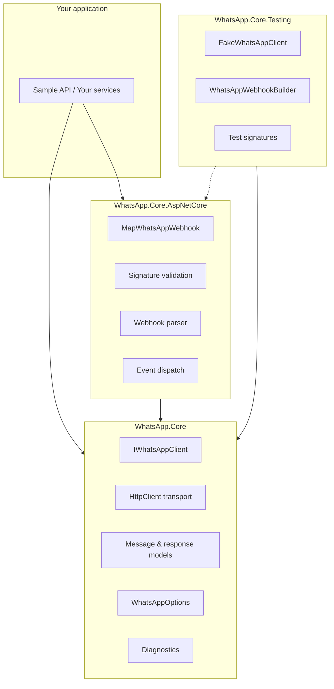
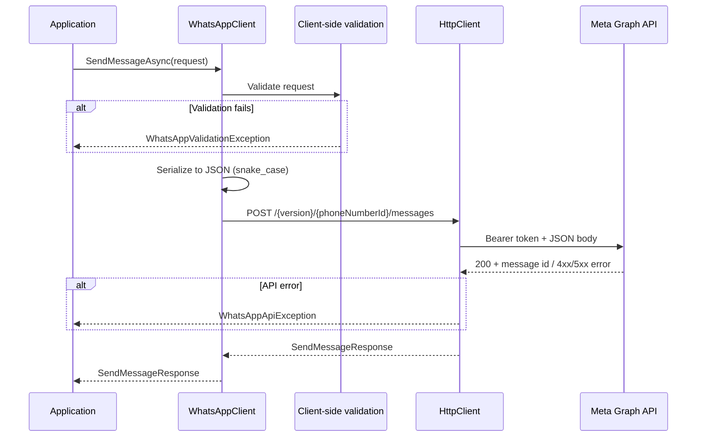
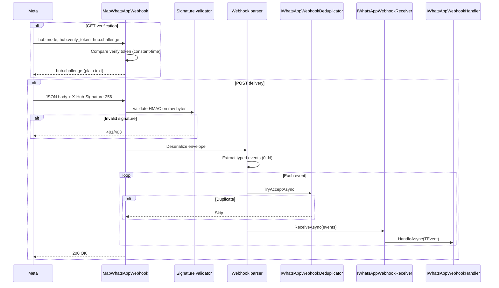

# Architecture

This document describes how WhatsApp.Core is structured, how requests flow through the system, and where you can extend behavior.

## Project boundaries

WhatsApp.Core is split into three NuGet packages with clear responsibilities:



| Package | References ASP.NET Core? | Purpose |
|---------|--------------------------|---------|
| **WhatsApp.Core** | No | HTTP client, message models, media, configuration, DI registration |
| **WhatsApp.Core.AspNetCore** | Yes | Webhook endpoint mapping, signature validation, typed event dispatch |
| **WhatsApp.Core.Testing** | No | Fakes, builders, and signature helpers for unit/integration tests |

Console applications, workers, and Azure Functions can use **WhatsApp.Core** alone. Add **WhatsApp.Core.AspNetCore** only when you need the webhook endpoint and handler infrastructure.

## Outbound request flow

When your code calls `IWhatsAppClient.SendMessageAsync` (or a convenience extension like `SendTextAsync`):



Key design decisions:

1. **Single HTTP path** - All message types serialize to the same `/messages` endpoint. Convenience methods build request records; they do not duplicate HTTP logic.
2. **Client-side validation first** - Obvious errors (missing recipient, empty body, both media id and link) fail before any network call.
3. **No automatic message retries** - A POST to `/messages` is not idempotent. A timeout or 5xx may mean the message was accepted. Retrying risks duplicate delivery.
4. **Named account isolation** - Each account gets its own named `HttpClient`, options snapshot, and authentication handler. Credentials never cross accounts.

## Webhook request flow

When Meta delivers a webhook to your ASP.NET Core application:



A single POST may contain multiple entries, changes, messages, and status updates. The parser produces a flat list of typed events; handlers are invoked per event.

## Signature verification

Signature validation is independent of ASP.NET Core request types:

```csharp
public interface IWhatsAppWebhookSignatureValidator
{
    bool IsValid(ReadOnlySpan<byte> payload, string suppliedSignature);
}
```

The endpoint reads the raw request body into a bounded buffer, validates the `sha256=` HMAC before JSON parsing, and rejects missing or malformed signatures. Comparison uses `CryptographicOperations.FixedTimeEquals`.

## Extension points

| Extension point | Default | Replace when |
|----------------|---------|--------------|
| `IWhatsAppClient` | `WhatsAppClient` | Rarely - use the factory for named accounts |
| `IWhatsAppClientFactory` | `WhatsAppClientFactory` | Rarely |
| `IWhatsAppWebhookReceiver` | `WhatsAppWebhookReceiver` | You want to enqueue events to Service Bus, RabbitMQ, etc. |
| `IWhatsAppWebhookHandler<TEvent>` | Your handlers | Always - this is how you process events |
| `IWhatsAppWebhookDeduplicator` | `MemoryWhatsAppWebhookDeduplicator` | Multi-instance apps, or you need durable shared-store dedup |
| `IWhatsAppWebhookSignatureValidator` | Built-in HMAC validator | Custom validation logic (unusual) |

Replace `IWhatsAppWebhookReceiver` to acknowledge webhooks quickly and persist events to durable infrastructure. The default in-process receiver invokes handlers synchronously (or with bounded parallelism) before returning 200 - suitable for lightweight processing only.

## Named clients

Multiple WhatsApp Business numbers register as named accounts:

```csharp
services.AddWhatsAppCore("support", section => { /* ... */ });
services.AddWhatsAppCore("sales", section => { /* ... */ });
```

Each account name maps to:

- A separate `IOptions<WhatsAppOptions>` named configuration
- A dedicated `HttpClient` with its own bearer token handler
- Isolated diagnostic tags (`account.name`)

The default account (`Default`) also registers a parameterless `IWhatsAppClient`. Named accounts resolve through `IWhatsAppClientFactory.CreateClient(name)`.

Webhook endpoints can target a specific account via `WhatsAppWebhookOptions.AccountName`.

## Forward compatibility

Meta may add message types and JSON fields before this library is updated. WhatsApp.Core handles this explicitly:

- **Unknown inbound message types** deserialize to `UnknownWhatsAppMessageEvent` with the raw `JsonElement` preserved.
- **Unknown JSON properties** on known models are captured via `JsonExtensionData`.
- **Unknown webhook change fields** do not fail the entire payload.
- **`SendRawMessageAsync`** sends arbitrary JSON to the configured `/messages` endpoint without allowing host or auth override.

This lets applications handle new Meta features immediately while waiting for a library update.

## Why message sends are not retried

The WhatsApp Cloud API's message send endpoint is a **create** operation. Network failures are ambiguous:

- The request may never have reached Meta.
- Meta may have accepted the message but the response was lost.
- Meta may have rejected the message with a transient error that succeeds on retry - but also may have partially processed it.

Automatic retries on POST `/messages` could deliver duplicate messages to end users. The library therefore:

- Never retries message sends or media uploads by default.
- Exposes `WhatsAppApiException.IsTransient` and `RetryAfter` so **you** can implement an informed policy.
- Offers opt-in safe retries only for idempotent operations (GET media metadata, DELETE media) via `WhatsAppResilienceOptions`.

## Related documentation

- [Configuration](configuration.md)
- [Sending messages](sending-messages.md)
- [Webhooks](webhooks.md)
- [Error handling](error-handling.md)
- [Observability](observability.md)
