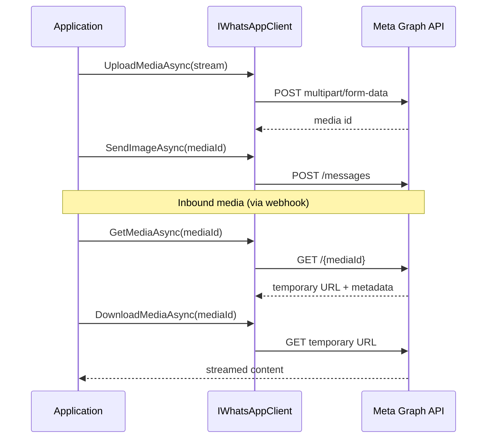

# Media

WhatsApp.Core supports uploading, retrieving metadata, streaming downloads, and deleting media assets through `IWhatsAppClient`.

## Overview

Media workflow typically follows these steps:

1. **Upload** a file to Meta's servers (optional if sending by public URL).
2. **Send** a message referencing the returned media id, or reference a public link directly.
3. **Retrieve metadata** to get a temporary download URL (for inbound media).
4. **Download** the content as a streamed response.
5. **Delete** the media when no longer needed.



## Uploading media

Upload a file from a stream. The content is streamed to Meta - it is not fully buffered in memory:

```csharp
await using FileStream file = File.OpenRead("document.pdf");

MediaUploadResponse upload = await client.UploadMediaAsync(
    content: file,
    fileName: "document.pdf",
    contentType: "application/pdf",
    stopToken: stopToken);

string mediaId = upload.Id;
```

Use the media id in subsequent send calls:

```csharp
await client.SendDocumentAsync(
    to: "353871234567",
    mediaId: mediaId,
    fileName: "document.pdf",
    caption: "Please review",
    stopToken: stopToken);
```

### Supported MIME types

Use the correct MIME type for the file format. Common types include:

| Type | MIME |
|------|------|
| JPEG image | `image/jpeg` |
| PNG image | `image/png` |
| PDF document | `application/pdf` |
| MP4 video | `video/mp4` |
| OGG audio | `audio/ogg` |
| WebP sticker | `image/webp` |

Refer to [Meta's media documentation](https://developers.facebook.com/docs/whatsapp/cloud-api/reference/media) for size limits and supported formats.

## Sending media by URL

When the media is already hosted at a publicly reachable HTTPS URL, skip the upload:

```csharp
await client.SendImageAsync(
    to: "353871234567",
    link: "https://example.com/photo.jpg",
    caption: "Product photo",
    stopToken: stopToken);
```

Exactly one of `mediaId` or `link` must be provided. Providing both or neither throws `WhatsAppValidationException`.

## Retrieving metadata

Get metadata for a media id (typically from an inbound webhook's media reference):

```csharp
MediaMetadata metadata = await client.GetMediaAsync("MEDIA_ID", stopToken);

string? mimeType = metadata.MimeType;
long? fileSize = metadata.FileSize;
string? sha256 = metadata.Sha256;
```

The metadata includes a temporary download URL. **Do not cache this URL** - it expires. Always call `GetMediaAsync` (or `DownloadMediaAsync`, which does this internally) before downloading.

## Downloading media

Download returns a disposable streamed result:

```csharp
await using WhatsAppMediaDownload download =
    await client.DownloadMediaAsync("MEDIA_ID", stopToken);

Console.WriteLine($"Type: {download.ContentType}");
Console.WriteLine($"Size: {download.ContentLength}");
Console.WriteLine($"Name: {download.FileName}");

await using FileStream output = File.Create("downloaded.bin");
await download.Content.CopyToAsync(output, stopToken);
// DisposeAsync releases the HTTP response and stream
```

`WhatsAppMediaDownload` properties:

| Property | Description |
|----------|-------------|
| `Content` | Live forward-only network stream (not buffered) |
| `ContentType` | MIME type |
| `ContentLength` | Size in bytes, if reported |
| `FileName` | Suggested file name, if reported |

Always dispose promptly with `await using`. Do not retain the stream beyond the lifetime of the download object.

## Deleting media

Remove a media asset from Meta's servers:

```csharp
await client.DeleteMediaAsync("MEDIA_ID", stopToken);
```

Deletion is idempotent from Meta's perspective and is eligible for opt-in safe retries (see [Error handling](error-handling.md)).

## Inbound media from webhooks

When a user sends media, the webhook event (for example `WhatsAppImageMessageEvent`) includes media metadata with an id. Use that id with `DownloadMediaAsync`:

```csharp
public sealed class ImageMessageHandler(IWhatsAppClient client, ILogger<ImageMessageHandler> logger)
    : IWhatsAppWebhookHandler<WhatsAppImageMessageEvent>
{
    public async Task HandleAsync(WhatsAppImageMessageEvent notification, CancellationToken stopToken)
    {
        logger.LogInformation(
            "Inbound image. MessageId={MessageId}, MediaId={MediaId}",
            notification.MessageId,
            notification.Media.Id);

        await using var download = await client.DownloadMediaAsync(notification.Media.Id, stopToken);
        // Process stream...
    }
}
```

Log media ids, not download URLs - URLs are temporary and may contain sensitive tokens.

## Resilience

Media metadata retrieval (GET) and deletion (DELETE) support opt-in safe retries when `WhatsAppResilienceOptions.EnableSafeRetries` is `true`. Uploads and downloads are not automatically retried.

## Related documentation

- [Sending messages](sending-messages.md) - Send image, document, audio, video, and sticker messages
- [Webhooks](webhooks.md) - Receive inbound media events
- [Error handling](error-handling.md) - Media operation failures
